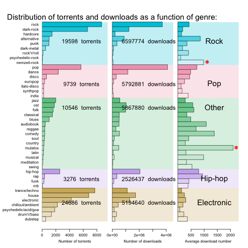

Ncore music genre analysis
========================================================

## Motivation

Earlier this year I saw an excellent google [visualization](http://research.google.com/bigpicture/music/) showing which music genres are still popular from a given date. That graph shows that the poularity of modern rock is shrinking. In a way this is not surprising, as today there are so many different genres for a very diverse audience, so unlike many blogs and sites commenting on that graph, I am not pessimistic about the future of rock. Time will tell which of today's music deserves to have future...

But on the other hand, I started to wonder what users on the biggest Hungarian torrent site are listening. What genres do they prefer? In this project, I analized the distribution of genres and the number of downloads of different genres. The task was difficult, as the genre field of the torrent data sheet is not strictly defined, it is up to the user to fill that field upon uploading, or even they can omit at all. This yield an extremely diverse set of variable with over 2200 separate values.

**The analysis can be divided into the following steps:**

1. **Parse genre data:** during the torrent data sheet processing, the genre information is stored in one field of a csv file, where each genre is separated by an underscore. In this step, the torrent data file is read by a Perl script, that separates the genre fields (as more genres can be associated to one music torrent), and saves it paired with the torrent ID in a new csv file.
2. **Clean genre list:**  the originally assigned genres form a very heterogenous list with arbitrary definitions and typos. In this step, I define a smaller genre set that covers as many music files as possible.
3. **Summarizing genre data:** the number of torrent files and downloads are summarized over the associated genres. In the resulted table each row represents one genre.
4. **Visualization and discussion:** I was interested in how the number of torrents and downloads distributed among genres and genre categories. For the visualization I chose _treemap_ that is especially good to get a qualitative idea about the distribution of hierachical categories, and _barchart_ that allows a more quantitative insight with a much better resolution. With these methods we can point out genres that are more frequently uploaded and those that are more frequently downloaded.

### Step 1. Reading and separating genre information:

Upon downloading the torrent datasheet, every piece of information is saved into a csv file, where each line corresponds to one torrent ID. As potentially multiple genres can be associated to one torrent ID, genres are fused together with underscores to keep all genres in a single field of the csv sheet.

In the first step, the genre field of the csv file had to be separated into individual genres. As this process was really slow with R, I decided to use Perl. The suitable script saved each genre with the corresponding torrent ID into a new csv file, that could be read by R directly as a dataframe. The following example shows how this script worked:

**input:**<br \>
>1488270,5,1,2014-02-10,21:53:02,12,MP3,EN,house_dance_electronic<br \>

**output:**<br \>
>1488270,house <br \>
>1488270,dance <br \>
>1488270,electronic <br \>

```R
# call Perl script, save csv
system("perl Genre_reader.pl torrent_data_NoTitle.csv")

# Reading csv file:
raw_genres <- read.csv("genres_raw.csv", header=T)

AssignedGenres        <- nrow(raw_genres)
raw_genre_difinitions <- length(table(raw_genres$Genre))
TorrentNumber         <- length(table(raw_genres$TorrentID))
UnAssignedTorrents    <- nrow(raw_genres[ raw_genres$Genre == "Na",])
UnAssignedRatio       <- round(100* UnAssignedTorrents / length(table(raw_genres$TorrentID)),2)

cat("Number of torrent files:", TorrentNumber,
    "\nNumber of assigned genres:", AssignedGenres,
    "\nNumber of different genre definitions:", raw_genre_difinitions,
    "\nNumber of torrents without genre definition:", UnAssignedTorrents, "(", UnAssignedRatio, "% of the total torrent population)\n")
```
**Output:**
> Number of torrent files: 70282
> Number of assigned genres: 142248
> Number of different genre definitions: 2279
> Number of torrents without genre definition: 2684 ( 3.82 % of the total torrent population)

Based on the generated report, users assigned over 140 thousand genres to 70 thousand uploaded music, and only 4% of the music had no genre assigned. The variability of the genre definitions is unimaginable: more than 2200 definitions were used!

### Step 2. Cleaning genre list

To make the genre definition list more concise, I used the combination of Perl scripts and R commands. I first selected the first 200 most commonly used genres and manually processed them to get rid of non-meaningful words and typos.

```R
genre_table        <- table(raw_genres$Genre)
genre_table        <- sort(genre_table, decreasing=T)
top200_genre       <- labels(genre_table[1:200])[[1]]
Top200_genre_count <- sum(genre_table[1:200])
All_genre_count    <- sum(genre_table)
Top200_genre_ratio <- round(Top200_genre_count / All_genre_count * 100, digits=1)

write(top200_genre, "./top200genres.txt", sep=" ")
returned           <- system2("./Top100_representativeness.pl", stdout=TRUE)

cat("Most frequently used 100 genre definitions:\n", top200_genre)
cat("TOP200 genre definitions covers",Top200_genre_ratio, "percent of all genre annotations.")
writeLines(returned)
```

Based on the report generated by the commands listed above, the most frequently used 200 genre definitions covers 93% of the torrents, and 90% of the 142 thousand genre assignment.


The barplot shows that there are only a few very frequently used genres, while most genres in the Top200 are already quite rare. So the Top 200 definition quite well covers the dataset, though 200 definition is way too many to visualize and it also has incosistentencies. In the following section I show the result of the optimization.

I have developed a genre mask to fix the most commonly occuring typos, the mask omitted non-real genre definitions ("192kb", "80s", "live" etc.),  pooled closely related genres like "nordic metal" and "viking metal". Finally, the genre mask had 203 entries that restricted the genre set to only 42 definitions (see: mask_definitions.txt and Tag_cleaner.pl) that were further grouped into five categories: "rock", "electronic", "pop", "hip-hop", "other".

__The list of the final genre definitions:__
* __Electronic:__ "dubstep" "chillout/ambient" "drum'n'bass" "electronic" "psychedelic/acid/goa" "house" "trance/techno"
* __Hip-hop:__ "rnb" "funk" "rap" "hip-hop"
* __Other:__ "musical" "swing" "meditation" "mulatos" "latin" "comedy" "soul" "reggae" "country" "ost" "audiobook" "blues" "jazz" "classical" "folk"
* __Pop:__ "italo-disco" "indie" "synthpop" "dicso" "europop" "dance" "pop"
* __rock:__ "nemzeti-rock" "rock'n'roll" "psychedelic-rock" "alternative" "punk" "dark-metal" "hardcore" "dark-rock" "rock"

```R
# running the final Perl script that appies the mask on the raw genre set
report        <- system2("./Tag_cleaner.pl", args=c("torrent_data_NoTitle.csv"), stdout=TRUE)
writeLines(report)

CleanGenre    <- read.csv("genres_clean_final.csv", header=T)
```

**Output:**
> Non-covered genres: 7939 (5%)<br />
> Covered, but non-valid genres: 13659 (9%)<br />
> Valid genres: 123745 (85%)<br />
> Torrents with at least one valid genre mask: 67852 (92%)<br />

According to the report, most of the genre definitions are masked (95%) and most of the masked genres (85%) were associated to any of the valid genre definitions. The valid genre definitions efficiently cover the torrent population, where 92% of torrent files has at least one associated genre definition.


### Step 3. Summarizing genre data:

Summaraizing the number of torrents belonging different genres and the corresponding download number was also not challenging, as torrents often have contradicting genre annotations (In extreme cases, a single torrent can have 15 assigned genres). So I have decided to split both the torrent count and download number between genres. **For example:** if there is a torrent with 120 downloads and three assigned genres, then each genre got 1/3 count and 40 downloads.

```R
# Creating a restricted dataset to make the process quick, will be removed in the final verision.
# CleanGenre_small <- CleanGenre[1:5000, ]

# Adding an extra column to the cleaned genre dataframe that contain how many genres were assigned to a given torrent ID:
CleanGenre    <- read.csv("genres_clean_final.csv", header=T)
ID_Table      <- table(CleanGenre$ID)
system.time(Count         <- sapply(as.character(CleanGenre$ID), function(x) ID_Table[x]))

# To fill dataframe with torrent data -> at first the torrent datafile is loaded:
Torrent_df             <- read.csv(file="torrent_data_NoTitle.csv", header=T)
Torrent_df             <- Torrent_df[!is.na(Torrent_df$TorrentID),]
Torrent_df$Downloaded  <- as.numeric(as.character(Torrent_df$Downloaded)) # set download number numeric

### Fill dataframe with download number:
DownloadCount     <- sapply(CleanGenre$ID, function(x) Torrent_df[ Torrent_df$TorrentID == x, "Downloaded"][1])

# Extend genre dataframe with the previously calculated data (already normalized to the number of assigned genres):
CleanGenre$TorrentCount <- 1 / Count
CleanGenre$Downloads    <- CleanGenre$TorrentCount * DownloadCount

# Genre definitions in the cleaned dataset:
genres            <- names(table(CleanGenre$genre))
categories        <- sapply(genres, function(x) CleanGenre[ CleanGenre$genre == x, "Category"][1])

# Combining all data into a single dataframe:
GenreDf           <- data.frame(genres = genres, categories = categories)

# calculate how many torrents belong to each genre definition:
TorrentCount      <- sapply(GenreDf$genres, function(x) sum(CleanGenre[ CleanGenre$genre == x, "TorrentCount"]))
GenreDf$Count     <- TorrentCount

# calculte how many downloads belong to each genre definition:
TorrentDownloads  <- sapply(GenreDf$genres, function(x) sum(CleanGenre[ CleanGenre$genre == x, "Downloads"]))
GenreDf$Downloads <- TorrentDownloads

# Calculating the "relative popularity" of torrents: average download number
GenreDf$averageDownloads <- GenreDf$Downloads / GenreDf$Count

# Sorting dataframe based on category then based on torrent count:
GenreDf           <- GenreDf[ order(GenreDf[,"categories"], GenreDf[,"Count"]),] # Sorting for count

```

### Step 4. Visualization and discussion:

Before visualization, I assigned colors to each genre that makes it easier to identify them on various graphs. There are base colors that are selected for categories then color gradient is generated from the base color to white based on the count of the given genre. (In the coloring function, I have implemented a scaled coloring method where the intensity of the assigned color depends on the relative count value. In this case this method is not applicable as generally there is one or two large value with strong color, and a lot of small values with very faint colors.)

```R
# At first we assign colors to each genre to get a nice color gradient (R snipplet was developed for this task)
source("coloring.R")
GenreDf$colors<-coloring(GenreDf, level_1="categories", level_2="genres", values="Count", scale=F)
```

To get a qualitative overview how the number of torrents and downloads are distributed among main categories and further genres, I used **treemap** which is especially useful to visualize hierarchical data, where the area of a category (*leaf*) is proportional to its relative value, and these areas are further grouped.


This visulaization already indicates that the highest number of torrents not necessarely yields the highest number of downloads. As we can see, while the most frequently uploaded genres belong to the **Electronic** category, the most frequently downloaded torrents belong to **rock**. (The colors of the genres are kept constant for the better comparability)

And there are genres that has a lot of downloads although the low number of torrents. To further amplify these differences, the average download number of a given genre was calculated. And to get a really comparative view of the genre usage, I created a barchart:




### Files in the folder:

**R scripts:**
* **coloring.R** - Assign color gradient to the values of dataframe based on their value and the category
* **triple_barchart.R** - Plots triple barchar with torrent counts, downloads and ratio.

**Perl scripts:**
* **genre_reader.pl** - Reads source csv datafile and extracts genre information and saves in a more digestable format.
* **Tag_cleaner.pl** - This script applied the developed mask.
* **Top200_representativeness.pl** - Calculates how many of the torrents are represented by the top 200 genres.

**Data files:**
* **torrent_data_NoTitle.csv** - Source datafile with all torrent information.
* **genres_raw.csv** - The raw list of assigned genres and the torrent IDs.
* **top200genres.txt** - List of the 200 most frequently used genres, generated during the analyis.
* **genres_clean_final.csv** - List of the masked genre list assigned for all torrent IDs.
* **uncovered.csv** - Genres that are not covered by the mask.
* **mask_definitions** - List with the mask applied.

**Documentation:**
* **Readme.md** - this file
* **genres.Rmd** - R markdown documentation, can be translated to html file.

