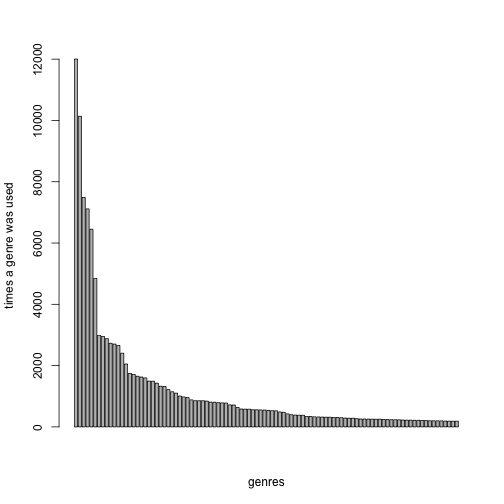

Ncore music genre analysis
========================================================

Earlier this year I saw an excellent google [visualization](http://research.google.com/bigpicture/music/) showing which music genres are still popular from a given date. That graph shows that the poularity of modern rock and metal, my favourite genres, are shrinking. In a way this is not surprising, as today there are so many different genres for a very diverse audience, so unlike many blogs and sites commenting on that graph I am not pessimistic about the future of rock. Time will tell which of today's music deserves future...

But on the other hand, I started to wonder what users on the biggest Hungarian torrent site are listening. What genres do they prefer? What set they can chose from? In this project, I analized the distribution of genres and the number of downloads of different genres. The task was difficult, as the genre field of the torrent data sheet is not strictly defined, it is up to the user to fill that upon uploading, or even they can omit at all. This yield an extremely diverse set of variable with over 2500 separate values.

**The analysis can be divided into the following steps:**

1. **Read and separate genre:** the torrent data file is read by a Perl script, separates the genre fields (as more genres can be associated to one music torrent), and saves a new csv, where each row corresponds to one genre.
2. **Clean genre list:** it is up to the uploader of the torrent to assign a genre to the music, the assigned genres form a very heterogenous list with arbitrary definitions and typos. In this step I define a restricted genre list to cover music files as completely as possible.
3. **Summarizing genre data:** a dataframe is built, where each row represents one genre and the number of torrent file associated with that genre and the number how many times these torrets have been downloaded. An other column is also calculated showing the average download number of the torrents of that genre.
4. **visualize trends and patterns:** barplots shows which genres are more frequen among uploaded torrents and among the downloads. Treeplot shows the relative distribution of genres.

### Step 1. Reading and separating genre information:

```r
# call Perl script, save cvs (OK)
system("perl Genre_reader.pl torrent_data_NoTitle.csv")

# Reading csv file:
raw_genres <- read.csv("genres_raw.csv", header = T)
```


To get an idea how the genre set looks like, I preformed an exploratory analysis:

```r
# Get information about the diversity of the source data: Number of torrens
# uncovered:
AssignedGenres <- nrow(raw_genres)

# Number of definitions:
raw_genre_difinitions <- length(table(raw_genres$Genre))

# Number of torrents:
TorrentNumber <- length(table(raw_genres$TorrentID))

# Number of torrents without genre definitions;
UnAssignedTorrents <- nrow(raw_genres[raw_genres$Genre == "Na", ])
UnAssignedRatio <- round(100 * UnAssignedTorrents/length(table(raw_genres$TorrentID)), 
    2)

cat("Number of torrent files:", TorrentNumber, "\nNumber of assigned genres:", 
    AssignedGenres, "\nNumber of different genre definitions:", raw_genre_difinitions, 
    "\nNumber of torrents without genre definition:", UnAssignedTorrents, "\nThat is", 
    UnAssignedRatio, "percent of the total torrent population.")
```

```
## Number of torrent files: 70282 
## Number of assigned genres: 142248 
## Number of different genre definitions: 2279 
## Number of torrents without genre definition: 2684 
## That is 3.82 percent of the total torrent population.
```

According to the report uploaders have used more than 2200 different genre definitions to describe 73k music, and only 4% of the music were uploaded without genre annotation. 

### Step 2. Cleaning genre list:

To make the genre definition list more concise, I applied an iterative process where with the combination of Perl scripts and R commands, I filtered out the most frequently made typo-s and inconsistent defintions. In this process I selected the first 100 most commonly used genres and manually processed them to get rid of non meaningful words for example 'and' as in some cases the following genres "rock and roll" and "drum and bass" are typed incorrectly and each word treated as separate genre definition. I also pooled closely related genres like "nordic metal" and "viking metal". Then I repeated this process where newer and newer definitions come up to the top 100. At the end of the optimization process, I organized the most common genres into five main categories: "rock", "pop", "hip-hop", "electronic" and "other".

#### Step 2/a: initial dataset:
To characterize the homogeneity and representativeness of the definition set, I calculated the ratio of torrents represented by the most frequently used 100 genres:

```r
# make a table with the genres:
genre_table <- table(raw_genres$Genre)

# sort table by value:
genre_table <- sort(genre_table, decreasing = T)

# get top 100 genre:
top100_genre <- labels(genre_table[1:100])[[1]]
cat("Most frequently used 100 genre definitions: ", top100_genre)
```

```
## Most frequently used 100 genre definitions:  rock house pop metal electronic trance dance hop techno progressive hip jazz psychedelic and alternative folk classical blues ost bass ambient drum psytrance punk hardcore tech disco hard 90s House deep dts 24bit new music world downtempo live age Metal 80s death soul dubstep funk Dance rap heavy Pop Rock indie Trance rhythm reggae power melodic country dub Electronic electro goa Techno Club thrash hdtracks gothic black symphonic hangosk%C3%B6nyv experimental latin Ambient italo minimal 70s europop soundtrack fullon industrial vocal hardstyle Disco club metalcore chillout breaks vinyl euro trip 60s post lounge Heavy celtic modern Progressive dark mulat%C3%B3s doom Downtempo
```

```r

# the usage frequency of the top 100 genre:
barplot(genre_table[1:100], names.arg = "", xlab = "genres", ylab = "times a genre was used")
```

 

```r

# representativeness of the top 100 genres among all genres
Top100_genre_count <- sum(genre_table[1:100])
All_genre_count <- sum(genre_table)
Top100_genre_ratio <- round(Top100_genre_count/All_genre_count * 100, digits = 1)
cat("How represetative the TOP100 genres of the total genre list:", Top100_genre_ratio)
```

```
## How represetative the TOP100 genres of the total genre list: 86
```

```r

# Saving the TOP100 genres for further processing
write(top100_genre, "top100genres.txt", sep = " ")

# get the number of torrents covered by the top 100 genre (external Perl
# script):
returned <- system2("./Top100_representativeness.pl", stdout = TRUE)
cat(returned)
```

```
##  Total number of torrents tested: 70283 Number of torrents represented by the TOP100 genre list: 63947 (90%)
```

So the Top 100 definition quite well covers the dataset, though 100 definition is still too many and there are incosistentencies in the labeling. In the following section I show the result of the optimization

#### Step 2/b: optimized dataset:

At the end of the optimization there was 41 genre definitions that were grouped further into 5 main categories. 


```r
# running the final Perl script that genereates a cleaned torrent ID list
# with the cleaned genre
system("perl Tag_cleaner.pl torrent_data_NoTitle.csv")
CleanGenre <- read.csv("genres_clean_final.csv", header = T)
CleanGenre$ID <- as.character(CleanGenre$ID)

# characterize the final set:
Genre_Table <- table(CleanGenre$genre)
ID_Table <- table(CleanGenre$ID)
cat("Number of genre definitions:", length(Genre_Table), "\nNumber of torrents covered:", 
    length(ID_Table), "That is", round(length(ID_Table)/TorrentNumber * 100, 
        1), "percent of the total torrent population.\n There is", nrow(CleanGenre), 
    "assignemnts, that cover", round(nrow(CleanGenre)/AssignedGenres * 100, 
        1), "percent of the original assignments")
```

```
## Number of genre definitions: 42 
## Number of torrents covered: 67848 That is 96.5 percent of the total torrent population.
##  There is 123745 assignemnts, that cover 87 percent of the original assignments
```


After the cleaning process, there were 42 genre definitions that describe the 96.5% of the total torrent population. This genre set

### Step 3. Summarizing genre data:

Then the dataset is separated based on genre classes. Both the download number and the torrent count were splitted among assigned genres. (That means if a torrent is assigned with 'rock' and 'pop' both genres got 0.5 count and half of the downloads. In extreme cases, a single torrent has 15 assigned genres.)


```r
# Creating a restricted dataset to make the process quick, will be removed
# in the final verision.
CleanGenre_small <- CleanGenre[1:5000, ]

# Adding an extra column to the cleaned genre dataframe that contain how
# many genres were assigned to a given torrent ID:
Count <- sapply(CleanGenre_small$ID, function(x) ID_Table[x], simplify = T)

# To fill dataframe with torrent data at first the torrent datafile is
# loaded:
Torrent_df <- read.csv(file = "torrent_data_NoTitle.csv", header = T)

# Formatting columns for handling:
Torrent_df$Downloaded <- as.numeric(as.character(Torrent_df$Downloaded))
```

```
## Warning: NAs introduced by coercion
```

```r

### Fill dataframe with download number:
DownloadCount <- sapply(CleanGenre_small$ID, function(x) Torrent_df[Torrent_df$TorrentID == 
    x, "Downloaded"])

# Extend genre dataframe with the previously calculated data (already
# normalized to the number of assigned genres):
CleanGenre_small$TorrentCount <- 1/Count
CleanGenre_small$Downloads <- CleanGenre_small$TorrentCount * DownloadCount

# Genre definitions in the cleaned dataset:
genres <- names(table(CleanGenre$genre))
cat(genres)
```

```
## alternative audiobook blues chillout/ambient classical comedy country dance dark-metal dark-rock dicso drum'n'bass dubstep electronic europop folk funk hardcore hip-hop house indie italo-disco jazz latin meditation mulatos musical nemzeti-rock ost pop psychedelic-rock psychedelic/acid/goa punk rap reggae rnb rock rock'n'roll soul swing synthpop trance/techno
```

```r
categories <- sapply(genres, function(x) CleanGenre[CleanGenre$genre == x, "Category"][1])

# Combining all data into a single dataframe:
GenreDf <- data.frame(genres = genres, categories = categories)

# calculate how many torrents belong to each genre definition:
TorrentCount <- sapply(GenreDf$genres, function(x) sum(CleanGenre_small[CleanGenre_small$genre == 
    x, "TorrentCount"]))
GenreDf$Count <- TorrentCount

# calculte how many downloads belong to each genre definition:
TorrentDownloads <- sapply(GenreDf$genres, function(x) sum(CleanGenre_small[CleanGenre_small$genre == 
    x, "Downloads"]))
GenreDf$Downloads <- TorrentDownloads

# Sorting dataframe based on category then based on torrent count:
GenreDf <- GenreDf[order(GenreDf[, "categories"], -GenreDf[, "Count"]), ]  # Sorting for count
```

### Step 4. Visualizing trends and patterns:

At first I wanted to visualize the relative frequencies of genres and downloads via a treeplot. To achieve this, the treeplot package was used. 

```r
# At first we assign colors to each genre to get a nice color gradient (R
# snipplet was developed for this task)
source("coloring.R")
GenreDf$colors <- coloring(GenreDf, level_1 = "categories", level_2 = "genres", 
    values = "Count", scale = F)
```

```
## 12345
```


```r
# install.packages('treemap') library('treemap')

treemap(GenreDf, index = c("categories", "genres"), vSize = "Count", vColor = "colors", 
    type = "color", title = "Distribution of torrents", fontsize.title = 20, 
    fontsize.labels = 14, force.print.labels = TRUE, drop.unused.levels = T, 
    fontcolor.labels = "black")
```

```
## Error: could not find function "treemap"
```


``
