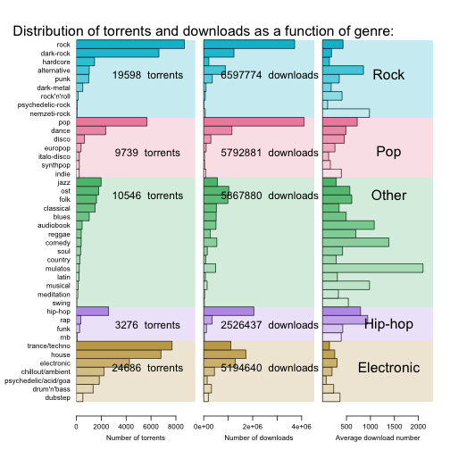

Ncore music genre analysis
========================================================

Earlier this year I saw an excellent google [visualization](http://research.google.com/bigpicture/music/) showing which music genres are still popular from a given date. That graph shows that the poularity of modern rock is shrinking. In a way this is not surprising, as today there are so many different genres for a very diverse audience, so unlike many blogs and sites commenting on that graph, I am not pessimistic about the future of rock. Time will tell which of today's music deserves to have future...

But on the other hand, I started to wonder what users on the biggest Hungarian torrent site are listening. What genres do they prefer? What set they can chose from? In this project, I analized the distribution of genres and the number of downloads of different genres. The task was difficult, as the genre field of the torrent data sheet is not strictly defined, it is up to the user to fill that field upon uploading, or even they can omit at all. This yield an extremely diverse set of variable with over 2500 separate values.

**The analysis can be divided into the following steps:**

1. **Parse genre data:** during the torrent data sheet processing, the genre information is stored in one field of a csv file, where each genre is separated by an underscore. In this step, the torrent data file is read by a Perl script, that separates the genre fields (as more genres can be associated to one music torrent), and saves it paired with the torrent ID in a new csv file.
2. **Clean genre list:**  the originally assigned genres form a very heterogenous list with arbitrary definitions and typos. In this step, I define a smaller genre set that covers as many music files as possible.
3. **Summarizing genre data:** the number of torrent files and downloads are summarized over the associated genres. In the resulted dataframe each row represents one genre.
4. **Visualization and discussion:** I was interested in how the number of torrents and downloads distributed among genres and genre categories. For the visualization I chose _treemap_ that is especially good to get a qualitative idea about the distribution of hierachical categories, and _barchart_ that allows a more quantitative insight with a much better resolution. With these methods we can point out genres that are more frequently uploaded and those that are more frequently downloaded.

### Step 1. Reading and separating genre information:

Upon downloading the torrent datasheet, every piece of information is saved into a csv file, where each line corresponds to one torrent ID. As potentially multiple genres can be associated to one torrent ID, genres are fused together with underscores to keep all genres in a single field of the csv sheet.

In the first step, the genre field of the csv file had to be separated into individual genres. As this process was really slow with R, I decided to use Perl. The suitable script saved each genre with the corresponding torrent ID into a new csv file, that could be read by R directly as a dataframe. The following example shows how this script worked:

**input:**<br \>
`1488270,5,1,2014-02-10,21:53:02,12,MP3,EN,house_dance_electronic`<br \>

**output:**<br \>
`1488270,house`<br \>
`1488270,dance`<br \>
`1488270,electronic`<br \>


```r
# call Perl script, save csv
system("perl Genre_reader.pl torrent_data_NoTitle.csv")

# Reading csv file:
raw_genres <- read.csv("genres_raw.csv", header = T)
```


An exploratory analysis gives an idea how heterogenous is the genre definition set. 


```r
AssignedGenres <- nrow(raw_genres)
raw_genre_difinitions <- length(table(raw_genres$Genre))
TorrentNumber <- length(table(raw_genres$TorrentID))
UnAssignedTorrents <- nrow(raw_genres[raw_genres$Genre == "Na", ])
UnAssignedRatio <- round(100 * UnAssignedTorrents/length(table(raw_genres$TorrentID)), 
    2)

cat("Number of torrent files:", TorrentNumber, "\nNumber of assigned genres:", 
    AssignedGenres, "\nNumber of different genre definitions:", raw_genre_difinitions, 
    "\nNumber of torrents without genre definition:", UnAssignedTorrents, "(", 
    UnAssignedRatio, "% of the total torrent population)\n")
```

```
## Number of torrent files: 70282 
## Number of assigned genres: 142248 
## Number of different genre definitions: 2279 
## Number of torrents without genre definition: 2684 ( 3.82 % of the total torrent population)
```

So uploaders used more than 2200 different genre definitions to describe 73000 music torents, luckily only 4% of the torrents were uploaded without genre annotation. 

### Step 2. Cleaning genre list:

To make the genre definition list more concise, I applied an iterative process where with the combination of Perl scripts and R commands, I constructed a genre mask that filtered out the most frequently made typo-s and inconsistent defintions. In this process I selected the first 100 most commonly used genres and manually processed them to get rid of non-meaningful words for example 'and' as in some cases the following genres "rock and roll" and "drum and bass" are typed incorrectly and each word treated as separate genre definition. I also pooled closely related genres like "nordic metal" and "viking metal". Then I repeated this process where newer and newer definitions come up to the top 100. 

#### Step 2/a: initial dataset:
To characterize the homogeneity and representativeness of the definition set, I calculated the ratio of torrents represented by the most frequently used 100 genres:

```r
genre_table <- table(raw_genres$Genre)
genre_table <- sort(genre_table, decreasing = T)
top100_genre <- labels(genre_table[1:100])[[1]]
Top100_genre_count <- sum(genre_table[1:100])
All_genre_count <- sum(genre_table)
Top100_genre_ratio <- round(Top100_genre_count/All_genre_count * 100, digits = 1)

write(top100_genre, "top100genres.txt", sep = " ")
returned <- system2("./Top100_representativeness.pl", stdout = TRUE)

cat("Most frequently used 100 genre definitions:\n", top100_genre)
```

```
## Most frequently used 100 genre definitions:
##  rock house pop metal electronic trance dance hop techno progressive hip jazz psychedelic and alternative folk classical blues ost bass ambient drum psytrance punk hardcore tech disco hard 90s House deep dts 24bit new music world downtempo live age Metal 80s death soul dubstep funk Dance rap heavy Pop Rock indie Trance rhythm reggae power melodic country dub Electronic electro goa Techno Club thrash hdtracks gothic black symphonic hangosk%C3%B6nyv experimental latin Ambient italo minimal 70s europop soundtrack fullon industrial vocal hardstyle Disco club metalcore chillout breaks vinyl euro trip 60s post lounge Heavy celtic modern Progressive dark mulat%C3%B3s doom Downtempo
```

```r
cat("TOP100 genre definitions covers", Top100_genre_ratio, "percent of all genre annotations.")
```

```
## TOP100 genre definitions covers 86 percent of all genre annotations.
```

```r
cat(returned)
```

```
##  Total number of torrents tested: 70283 Number of torrents represented by the TOP100 genre list: 63947 (90%)
```


Usage frequency of the top 100 genres:

```r
barplot(genre_table[1:100], names.arg = "", xlab = "Genres", ylab = "Times a genre was used")
```

 


The graph shows that there are only a few very frequently used genres, and most genres in the Top100 are already quite rare. So the Top 100 definition quite well covers the dataset, though 100 definition is still too many and there are incosistentencies in the labeling. In the following section I show the result of the optimization.

#### Step 2/b: optimized dataset:

At the end of the optimization, I have developed a genre mask with 203 entries that restricted the genre set to only 42 genre definitions (see: mask_definitions.txt and Tag_cleaner.pl) that were grouped into five categories: "rock", "electronic", "pop", "hip-hop", "other".


```r
# running the final Perl script that genereates a cleaned torrent ID list
# with the cleaned genre
system("perl Tag_cleaner.pl torrent_data_NoTitle.csv")
CleanGenre <- read.csv("genres_clean_final.csv", header = T)
CleanGenre$ID <- as.character(CleanGenre$ID)
```


Let's show a list of the final genre definitions: 


```r
# The final set:
for (categorie in levels(GenreDf$categories)) {
    cat(categorie, ": ")
    cat(shQuote(as.character(GenreDf[GenreDf$categories == categorie, "genres"]), 
        type = "cmd"), "\n")
}
```

```
## Error: object 'GenreDf' not found
```


Characterization of the optimized genre set:

```r
# characterize the final set:
Genre_Table <- table(CleanGenre$genre)
ID_Table <- table(CleanGenre$ID)
cat("Number of genre definitions:", length(Genre_Table), "\nNumber of torrents covered:", 
    length(ID_Table), "That is", round(length(ID_Table)/TorrentNumber * 100, 
        1), "percent of the total torrent population.\n There is", nrow(CleanGenre), 
    "assignemnts, that cover", round(nrow(CleanGenre)/AssignedGenres * 100, 
        1), "percent of the original assignments")
```

```
## Number of genre definitions: 42 
## Number of torrents covered: 67848 That is 96.5 percent of the total torrent population.
##  There is 123745 assignemnts, that cover 87 percent of the original assignments
```


After the cleaning process, there were 42 genre definitions that describe the 96.5% of the total torrent population.

### Step 3. Summarizing genre data:

Summaraizing the number of torrents belonging different genres and the corresponding download number is also not trivial, as torrents often have contradicting genre annotations (In extreme cases, a single torrent can have 15 assigned genres). So I have decided to split both the torrent count and download number between genres. **For example:** if there is a torrent with 120 downloads and three assigned genres, then each genre got 1/3 count and 40 downloads. 


```r
# Creating a restricted dataset to make the process quick, will be removed
# in the final verision.
CleanGenre_small <- CleanGenre[1:5000, ]

# Adding an extra column to the cleaned genre dataframe that contain how
# many genres were assigned to a given torrent ID:
Count <- sapply(CleanGenre_small$ID, function(x) ID_Table[x], simplify = T)

# To fill dataframe with torrent data at first the torrent datafile is
# loaded:
Torrent_df <- read.csv(file = "torrent_data_NoTitle.csv", header = T)

# Formatting columns for handling:
Torrent_df$Downloaded <- as.numeric(as.character(Torrent_df$Downloaded))
```

```
## Warning: NAs introduced by coercion
```

```r

### Fill dataframe with download number:
DownloadCount <- sapply(CleanGenre_small$ID, function(x) Torrent_df[Torrent_df$TorrentID == 
    x, "Downloaded"])

# Extend genre dataframe with the previously calculated data (already
# normalized to the number of assigned genres):
CleanGenre_small$TorrentCount <- 1/Count
CleanGenre_small$Downloads <- CleanGenre_small$TorrentCount * DownloadCount

# Genre definitions in the cleaned dataset:
genres <- names(table(CleanGenre$genre))
cat(genres)
```

```
## alternative audiobook blues chillout/ambient classical comedy country dance dark-metal dark-rock dicso drum'n'bass dubstep electronic europop folk funk hardcore hip-hop house indie italo-disco jazz latin meditation mulatos musical nemzeti-rock ost pop psychedelic-rock psychedelic/acid/goa punk rap reggae rnb rock rock'n'roll soul swing synthpop trance/techno
```

```r
categories <- sapply(genres, function(x) CleanGenre[CleanGenre$genre == x, "Category"][1])

# Combining all data into a single dataframe:
GenreDf <- data.frame(genres = genres, categories = categories)

# calculate how many torrents belong to each genre definition:
TorrentCount <- sapply(GenreDf$genres, function(x) sum(CleanGenre_small[CleanGenre_small$genre == 
    x, "TorrentCount"]))
GenreDf$Count <- TorrentCount

# calculte how many downloads belong to each genre definition:
TorrentDownloads <- sapply(GenreDf$genres, function(x) sum(CleanGenre_small[CleanGenre_small$genre == 
    x, "Downloads"]))
GenreDf$Downloads <- TorrentDownloads

# Calculating the 'relative popularity' of torrents: average download number
GenreDf$averageDownloads <- GenreDf$Downloads/GenreDf$Count

# Sorting dataframe based on category then based on torrent count:
GenreDf <- GenreDf[order(GenreDf[, "categories"], GenreDf[, "Count"]), ]  # Sorting for count
```


### Step 4. Visualization and discussion:

Before visualizing the summaries, 

```r
# At first we assign colors to each genre to get a nice color gradient (R
# snipplet was developed for this task)
source("coloring.R")
GenreDf$colors <- coloring(GenreDf, level_1 = "categories", level_2 = "genres", 
    values = "Count", scale = F)
```


To get a rather quanlitative overview of how the number of torrents are distributed among main categories and further genres, I used **treemap** that is an area based visualization where the area of a category (*leaf*) is proportional to its relative value. This visualization allows a hierarchical representation where subbranched categories are 


To visualize the realtive distribution of different music categories and genres within categories, I created a treemap:

```r
# the treemap visualization requires "treemap" package to be installed:
if("treemap" %in% rownames(installed.packages()) == FALSE) {install.packages("treemap")}

library("treemap")

treemap(
    GenreDf,            # dataframe with the data to plot
    index  = c("categories","genres"),  # The nested categories
    vSize  = "Count",   # The values that determine the size of the rectangles
    type   = "color",   # Coloring method: use pre-defined colors
    vColor = "colors",  # Column name with color definitions
    title  = "Distribution of torrents", 
    fontsize.title     = 20, 
    fontsize.labels    = 14,
    force.print.labels = TRUE,
    drop.unused.levels = T,
    fontcolor.labels   = "black"
)
```

 

To get a really comparative view of the genre usage, I created a barchart:


```r
source("triple_barchart.R")
triple_barplot(GenreDf)
```

```
## NA
```

 


``
