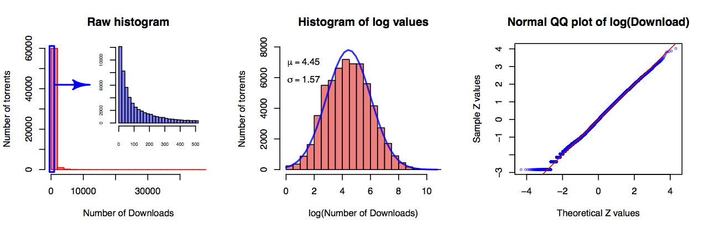
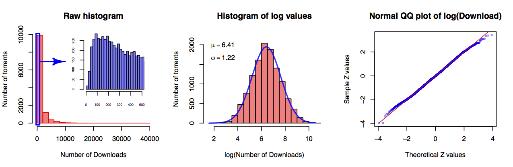
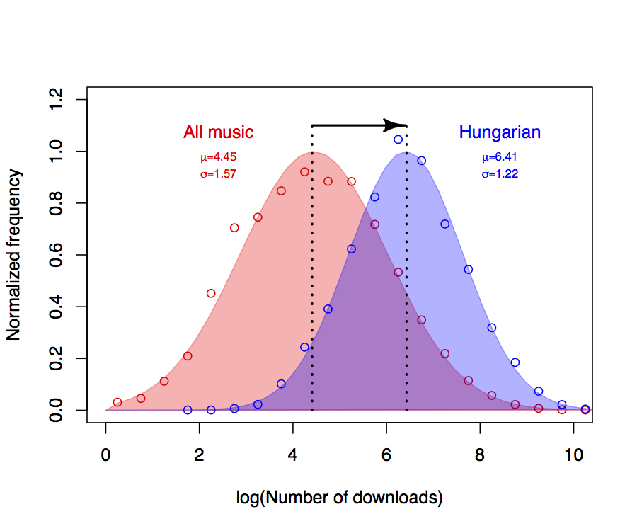
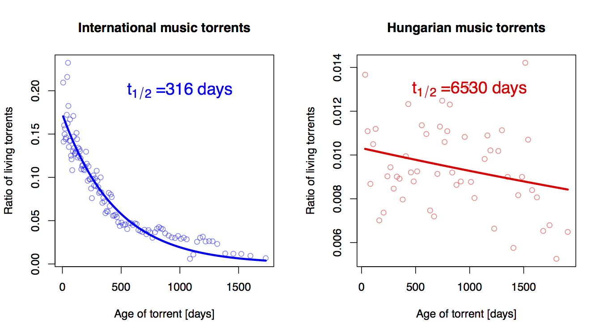

Analysis of music torrents
===========

## Motivation

In this analysis, I wanted to characterize the user preferences of the Hungarian torrent community. In this section I will show that users have a clear preference for the nationality of the music they download. It is often considered to be a big problem that the presence of English/American music is so overwhelming, that Hungarians are no longer interested in the national musicians' art. But this analysis proved this notion wrong, since the number of downloads and the half-life of torrents show that users are more likely to prefer Hungarian music.

While I used Perl to download torrent data, I did the analysis in R/RStudio as it made the analyis much easier and gave an excellent opportunity to familiarize myself with this language.

## The data:

To download data form the the torrent tracker I used the download Perl script listed in the Download folder with the following query parameters: `mp3_hun,mp3,lossless_hun,lossless`. From the saved csv file, the following variables were used:

* **ID** - Identifier of the torrent
* **U_date** - Upload date
* **Downloads** - Number of downloads
* **Nationality** - Nationality of the music, has two values: *HU*: Hungarian and *EN*: English 

## The analysis

### Loading the data

Once we have the data saved in the csv file, we can read it with the following R code, and keep it in the memory for all downstream analysis.

```R
TorrentData <- read.csv("torrent_data.csv")

# cleaning data from non-defined values:
TorrentData$TorrentID <- as.numeric(TorrentData$TorrentID)
TorrentData           <- TorrentData[!is.na(TorrentData$Downloaded),]
TorrentData           <- TorrentData[!is.na(TorrentData$Nationality),]

```

### Exploratory analysis

To take a look at the dataset I was working with:
```R
> nrow(TorrentData)
[1] 57160
```
As the focus of this analysis will be on the number of downlads, nationality and the upload date, a new restricted dataset was created:

```R
SubsetTable             <- TorrentData[, c("U_Date", "Downloaded", "Nationality")]
SubsetTable$U_Date      <- as.Date(SubsetTable$U_Date)
SubsetTable$Downloaded  <- as.numeric(as.character(SubsetTable$Downloaded))
SubsetTable             <- SubsetTable[SubsetTable$Nationality == 'EN' | SubsetTable$Nationality == 'HU',]
SubsetTable$Nationality <- factor(SubsetTable$Nationality)


source("smallfunctions.R")
SumTable(SubsetTable, "Nationality", "Downloaded") # Function is in the smallfunctions.R source file
```

| Factor | Number of torrents | Number of Downloads | Average Download | Median Download |
|--:|:--:|:--:|:--:|:--:|
|  EN  |  47521  |  14926189  |  314.0967  |  89  |
|  HU  |  9636  |  13256411  |  1375.717  |  689  |


### Distribution of downloads

As the table shows, the distribution of the downloads are extremely right-skewed, with a few very popular music and a lot of others with only a few downloads. This is exactly what we see on the boxplot:


This extreme skewedness imply that the distribution of the number of downloads might follow a lognormal distribution. To test this hypothesis, I  checked if the distribution of the logarithm of the downloads follows normal distribution using a normal QQ probability plot.

For international music torrents:

```R
source("Plots.R")
tripleplot(TorrentData[ TorrentData$Nationality == "EN", "Downloaded"])
```


For Hungarian music torrents:

```R
source("Plots.R")
tripleplot(TorrentData[ TorrentData$Nationality == "HU", "Downloaded"])
```


Graphs indicate that the download number of both categories follow a lognormal distribution. To make the difference more visible, the overlay of the two histograms of the logarythmic values were plot:

```R
Log_EN <- log(TorrentData[ TorrentData$Nationality == "EN", "Downloaded"])
Log_HU <- log(TorrentData[ TorrentData$Nationality == "HU", "Downloaded"])

source("Dualhist.R")
PlotDualHist(vector1=Log_EN, vector2=Log_HU, filename="dualhist")
```



### Half life of music torrents

Torrents over time lose their popularity. Sooner or later, no one will download and after a while, seeders will also disconect so finally, the torrent will be completely abandoned. The administrators of the torrent tracker deletes these inactive or so called "dead" torrents. The aim of this analysis was to calculate the "half-life"  of Hungarian and international music torrents, as besides the download number, the halflife of torrents could also be informative about the popularity.

#### Theory behind the half life calculation:

Calculation of the half-life is not easy as the type of the dataset is a result of an observational study and represents only a snapshot from the life of the torrent tracker. What makes it possible to do this calculation is the fact that the torrent IDs are increasing with 1 with every torrent. The difference between two torrent IDs means how many other torrents were uploaded between those two torrents.

If there is a gap between the IDs of two adjacent music torrent that could mean two things:
1. There were other type of torrents (application, movie, e-book etc.) uploaded between them.
2. There could be an other music as well, but that torrent could be deleted over time.

**The half-life calculation based on the following assumption:**
* The frequency of music torrents within the total torrent population was roughly the same over time.
* "Natural" cause of torrent death: only insignificant amount of torrents are deleted due to violation of rules.
* Though the rate of new torrent release is not have to be constant, the user activity is expected to be approximately even over time.

#### We used the following method to calculate half life:

1. Torrents are divided into smaller sized groups (500 torrents/groups)
2. **We calulate the frequency of still "living" music torrents within the subset:** the number of torrents within the subset is divided by the difference between the first and the last torrent ID in the subset (that corresponds to the number of total uploaded torrents during that period).
3. We calculate the median age of the torrents within the group. (reference day is the upload date of the newest torrent)
4. **Plot frequence of living torrents as a function of age** - I am expecting to see a set of point with a decreasing value that follows an exponential decay fashion.
5. The parameters of the fitted exponential decay curve gives us the *decay constant*. Then ln(2) divided by the decay constant gives the half-life (t1/2) of torrents.

The detailed list of command used for the analysis are listed in the file `HalfLifeCalculations.R`, the custom functions used during the calculations are in `half-life.R` file.



Based on the fitted exponentials, the half-life of torrent files of international music is little less than a year, torrents of Hungarian music lives approximately 20 times longer. Unfortunately the estimation of half-life of Hungarian music is less reliable caused by the much lower number of torrents.

### Discussion

Though international music seems to be really overwhelming that is reflected by the higher number torrent files as well, peolpe has a bias towards for Hungarian music, which is indicated by the significantly higher download rate and the longer lifetime of torrent files.

But at the same time, I had to mention that the legal online sources of Hungarian musics are not as well developed as for internationals, directing potential buyers towards the illegal sources like bittorrent. This is especially true for older pieces that are completely impossible to obtain from ANY legal sources except from flea markets or online auctions of used items.

